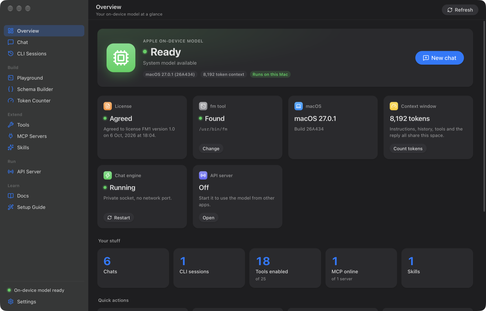
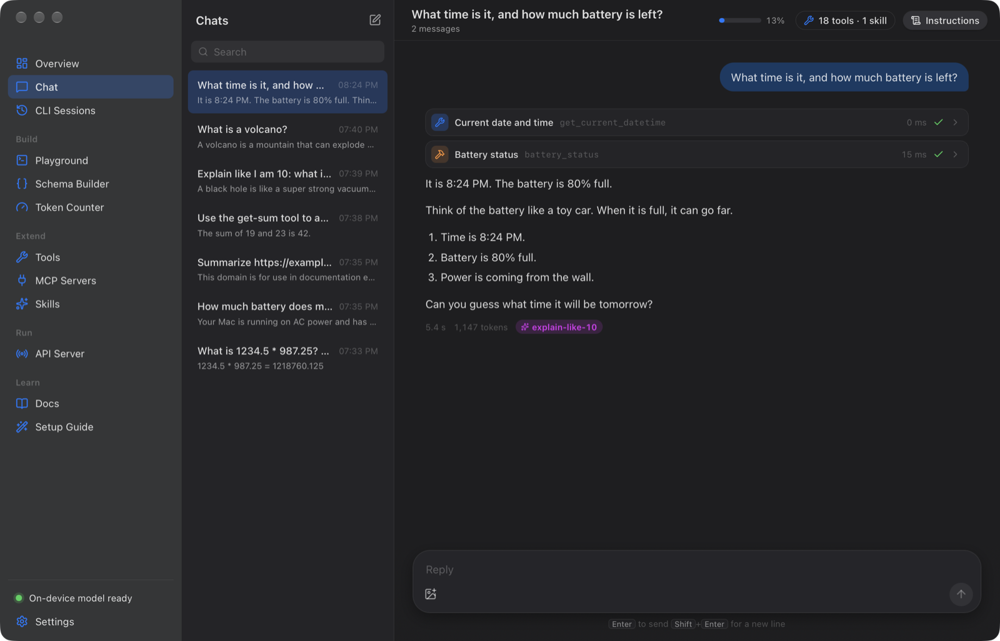
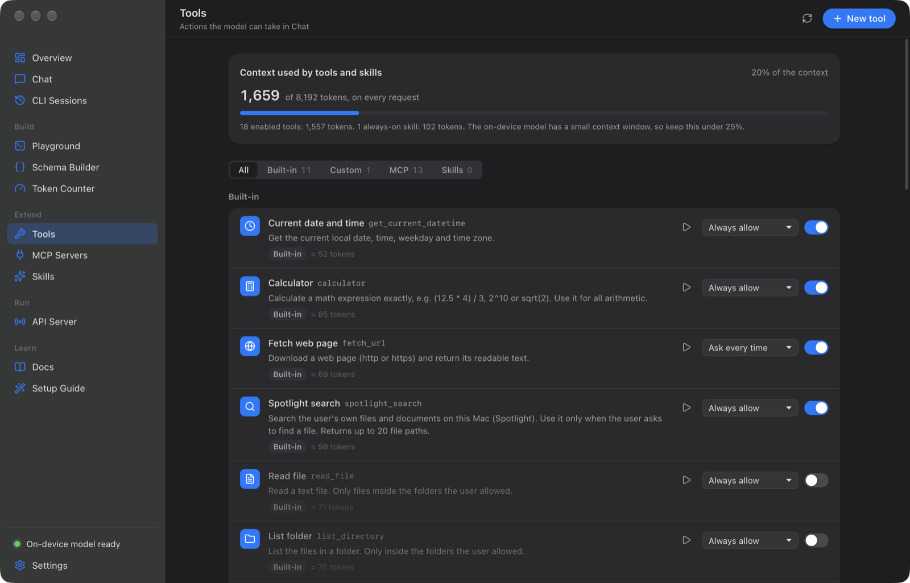
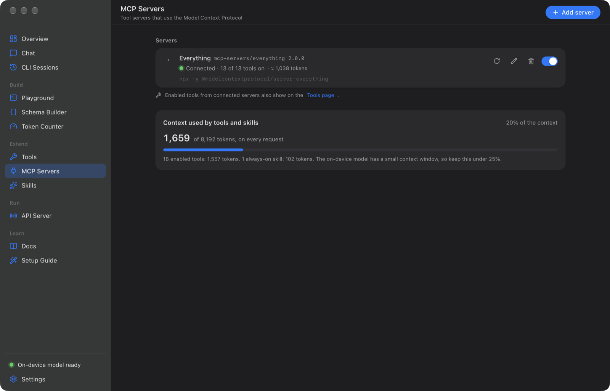
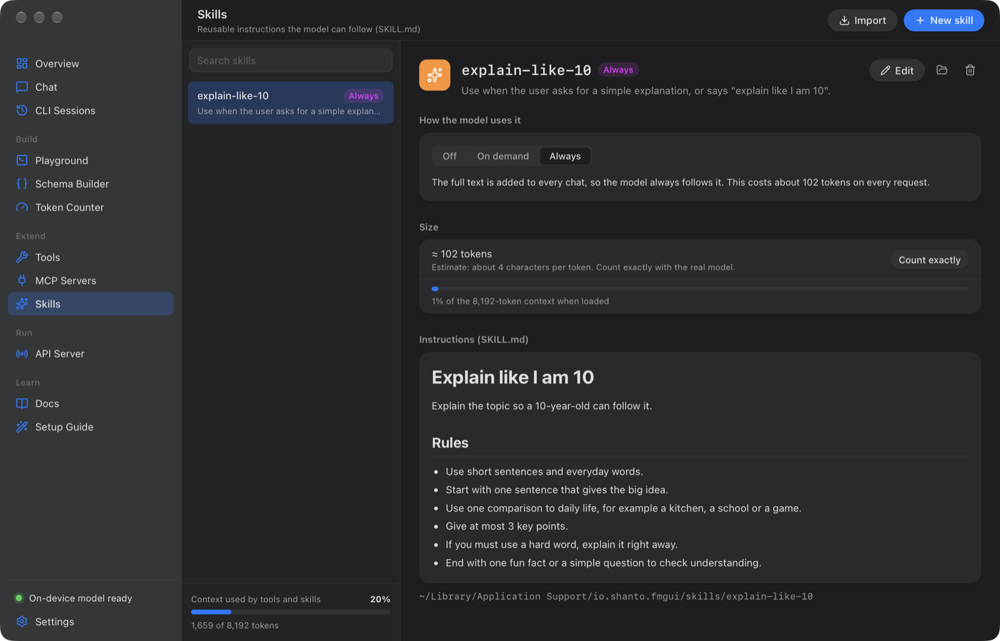
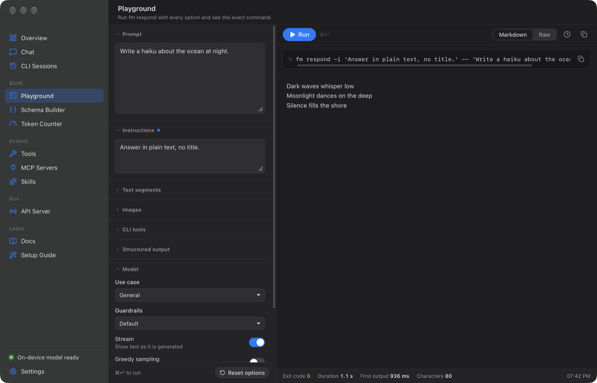
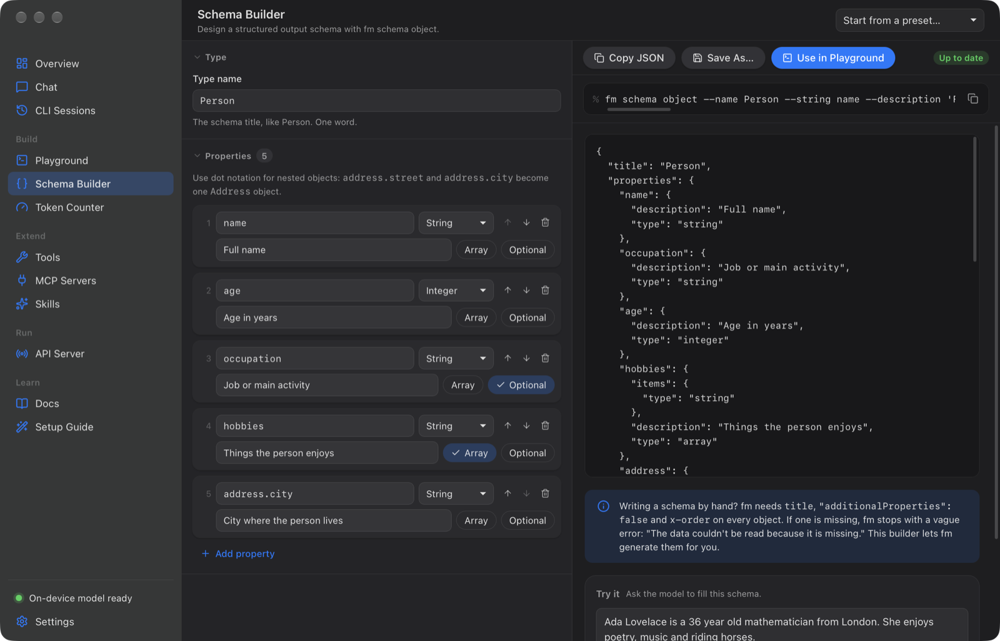
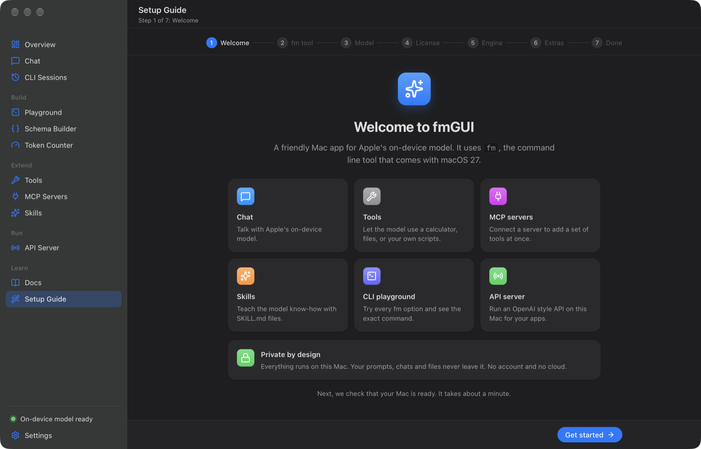

# fmGUI

[](https://github.com/shanto462/fmGUI/actions/workflows/ci.yml)
[](LICENSE)

**A native-feeling Mac app for Apple's on-device language model: chat with tools, MCP servers and skills, with no cloud and no API key.**

fmGUI is a desktop app for `fm`, the Apple Foundation Models command line tool that ships with macOS 27.
It is built with [Tauri 2](https://tauri.app) (a Rust backend and a React + TypeScript UI).

## Features

- **Chat** with the on-device model. Attach images, set instructions per chat, stop at any time, and watch how much of
  the context window is used.
- **Tools**: 11 built-in tools (date and time, calculator, web page text, Spotlight, files in folders you allow,
  shell, clipboard, links, Shortcuts) plus your own **shell**, **HTTP** and **Apple Shortcut** tools.
- **MCP servers** over stdio (`npx`, `uvx`, any command) or Streamable HTTP, with a step by step wizard and templates.
- **Skills**: `SKILL.md` instructions that are always on or loaded on demand. Import the skills you already have in
  `~/.claude/skills`.
- **Approvals**: tools that can change things ask first (Allow once, Always allow, Deny).
- **Quick Chat** from the menu bar: a Spotlight-like overlay that floats on top (Liquid Glass). Click outside and it
  shrinks to a small picture-in-picture pill; click the pill to grow it again. Closing the main window keeps fmGUI and
  Quick Chat running.
- **CLI Sessions**: browse, rename and continue the chats that `fm chat` saves in `~/.fm/sessions`.
- **Playground** for every `fm respond` option, a **Schema Builder** for `fm schema object`, and a **Token Counter**
  for `fm count-tokens`.
- **API Server**: start and watch a local `fm serve` (OpenAI-style Chat Completions) for other apps.
- **Docs** about `fm`, inside the app (the same pages are in [`docs/`](docs/README.md)).
- A **Setup Guide** that checks the license, Apple Intelligence and the model, and shows you how to fix each one.

Every action that runs the CLI shows the exact `fm ...` command, so you can copy it into Terminal.

## Screenshots

| | |
|---|---|
| <br>**Overview**: the model, license and engine at a glance | <br>**Chat** with tool steps and approvals |
| <br>**Tools**: built-in and custom, with their context cost | <br>**MCP Servers** |
| <br>**Skills** with off, on demand and always modes | <br>**Playground** for `fm respond` |
| <br>**Schema Builder** for `fm schema object` | <br>**Setup Guide** |

## Requirements

- macOS 27 or later.
- A Mac with Apple silicon (M1 or later).
- Apple Intelligence turned on (System Settings → Apple Intelligence & Siri).
- The on-device model downloaded. macOS downloads it (about 7 GB) after you turn on Apple Intelligence.
  `fm available` prints `System model available` when it is ready.
- The `fm` license accepted once, in Terminal: `sudo fm license`. fmGUI never accepts it for you.

## Install

### From a release

1. Download `fmGUI_<version>_aarch64.dmg` from the [Releases](https://github.com/shanto462/fmGUI/releases) page.
2. Open the DMG and drag **fmGUI** to **Applications**.
3. The app is not notarized by Apple yet, so macOS blocks the first start. Do one of these:
   - Right-click (or Control-click) **fmGUI** in Applications and choose **Open**. If macOS still blocks it, open
     **System Settings → Privacy & Security** and click **Open Anyway**.
   - Or remove the quarantine flag in Terminal:

     ```sh
     xattr -dr com.apple.quarantine /Applications/fmGUI.app
     ```

4. Start fmGUI. The Setup Guide opens and walks you through the rest. See
   [Getting started](docs/12-getting-started.md).

### Build from source

You need:

- **Node.js 22 or later** (for example `brew install node`).
- **Rust stable** through [rustup](https://rustup.rs) (or `brew install rustup`, then `rustup default stable`).
  Homebrew's rustup is keg-only, so add it to your PATH: `export PATH="$(brew --prefix rustup)/bin:$PATH"`.
- **Xcode Command Line Tools**: `xcode-select --install`.

```sh
git clone https://github.com/shanto462/fmGUI.git
cd fmGUI
npm install
npm run app          # run in development mode
npm run app:build    # build fmGUI.app and a .dmg
```

The release build ends up in `src-tauri/target/release/bundle/` (`macos/fmGUI.app` and `dmg/*.dmg`).
`scripts/release.sh` runs every check first, then builds, then prints both paths.

### npm scripts

| Script | What it does |
|--------|--------------|
| `npm run app` | Runs the app in development mode (Vite plus the Rust backend, reloads on changes). |
| `npm run app:build` | Builds the release `fmGUI.app` and `.dmg` in `src-tauri/target/release/bundle/`. |
| `npm run tauri` | The Tauri CLI, for example `npm run tauri info`. |
| `npm run dev` | Starts only the Vite dev server for the UI on port 1420 (no Rust). |
| `npm run build` | Type-checks and builds the UI into `dist/`. |
| `npm run typecheck` | Runs the TypeScript compiler without writing files. |
| `npm test` | Runs the UI unit tests once (Vitest). |
| `npm run test:watch` | Runs the UI unit tests in watch mode. |
| `npm run test:rust` | Runs the Rust unit tests (`cargo test` in `src-tauri`). |
| `npm run test:integration` | Runs the Rust tests plus the tests against the real `fm` (`FM_INTEGRATION=1`). Needs macOS 27, the model and the license. |
| `npm run lint` | Runs ESLint and `cargo clippy` (warnings are errors). |
| `npm run lint:fix` | Runs ESLint and fixes what it can. |
| `npm run format` | Formats the code with Prettier and `cargo fmt`. |
| `npm run format:check` | Checks the formatting without changing files. |
| `npm run verify` | Runs every CI check in one go (`scripts/verify.sh`). Add `FM_INTEGRATION=1` to also test against the real `fm`. |
| `npm run preview:mock` | Opens the UI in your browser with fake data (`/?mock=1`). No Rust and no `fm` needed. |

## How it works

- **The CLI layer.** Playground, Schema Builder, Token Counter, CLI Sessions and Setup run `/usr/bin/fm` directly
  (`fm respond`, `fm schema object`, `fm count-tokens`, `fm available`, `fm license --status`) and stream the output.
- **A private engine.** Chat talks to its own `fm serve` that fmGUI starts on a Unix socket in its data folder. No
  network port is opened, and other apps cannot reach it. The API Server page runs a second, separate `fm serve` for
  other apps (default `127.0.0.1:1976`).
- **A guided-JSON tool router.** On macOS 27.0.1, `fm serve` accepts `tools` but never returns `tool_calls`. So fmGUI
  asks the model, at temperature 0, for JSON with one choice per tool (`{"calculator": {"expression": "2+2"}}`) or
  `{"answer": {}}`.
- **The tool loop.** fmGUI runs the chosen tool, sends the result back as a `tool` message, and asks again, up to
  4 tool steps per turn (you can change this in Settings). Then the answer streams as plain Markdown.
- **Approvals.** Before a tool with "Ask every time" runs, the chat shows the arguments and waits for Allow once,
  Always allow, or Deny.
- **The context budget.** The model sees 8,192 tokens (some Macs report 4,096; change it in Settings). Every enabled
  tool and skill costs tokens in every request. fmGUI keeps the prompt to about 5,100 tokens, leaves out the oldest
  messages first, and cuts long tool results.
- **Quick Chat.** A second, frameless window with the same engine. Rust switches it between the overlay and the pill
  when it loses focus, and the UI reuses the Chat page components.
- **Clean processes.** Only one copy of fmGUI runs at a time. Every `fm serve` and MCP server it starts is stopped on
  quit, and leftovers from a crash are stopped at the next launch.
- **MCP and skills.** Enabled MCP servers start when the app starts, with your login shell PATH. On-demand skills are
  loaded by a `use_skill` tool only when the model needs them.

## Tools, MCP servers and skills

| Kind | Example | Guide |
|------|---------|-------|
| Built-in tool | `calculator`, `fetch_url`, `spotlight_search`, `read_file` | [Getting started](docs/12-getting-started.md) |
| Shell command | `pmset -g batt` (arguments arrive as `FM_ARG_<NAME>` variables, never pasted into the command) | [Custom tools](docs/13-custom-tools.md) |
| HTTP request | `GET https://wttr.in/{{city}}?format=3` | [Custom tools](docs/13-custom-tools.md) |
| Apple Shortcut | any shortcut from the Shortcuts app | [Custom tools](docs/13-custom-tools.md) |
| MCP server | Filesystem, Fetch, Memory, Time, Git, Sequential thinking, Everything, or your own | [MCP servers](docs/14-mcp-servers.md) |
| Skill | a `SKILL.md` with instructions for one kind of task | [Skills](docs/15-skills.md) |
| Quick Chat | The menu bar overlay and pill | [Quick Chat](docs/16-quick-chat.md) |

Built-in tools:

| Tool | What it does | On by default | Approval by default |
|------|--------------|---------------|---------------------|
| `get_current_datetime` | Current date, time, weekday and time zone | Yes | Always allow |
| `calculator` | Exact math, for example `(12.5 * 4) / 3` or `sqrt(2)` | Yes | Always allow |
| `fetch_url` | Downloads a web page and returns its text | Yes | Ask every time |
| `spotlight_search` | Finds files on this Mac with Spotlight (up to 20) | Yes | Always allow |
| `read_file` | Reads a text file in an allowed folder | No | Always allow |
| `list_directory` | Lists an allowed folder | No | Always allow |
| `write_file` | Writes a file in an allowed folder | No | Ask every time |
| `run_shell_command` | Runs a zsh command | No | Ask every time |
| `read_clipboard` | Reads the text on the clipboard | No | Ask every time |
| `open_url` | Opens a link in your browser | No | Ask every time |
| `run_shortcut` | Runs an Apple Shortcut by name | No | Ask every time |

The file tools only work inside the folders you add in **Settings → Allowed folders**.

## Privacy

- The model runs on your Mac. Your chats, prompts and files are not sent to Apple or to anyone else by fmGUI.
- fmGUI has no analytics and no telemetry.
- fmGUI only uses the network for things you turn on: the `fetch_url` tool, HTTP custom tools, remote MCP servers,
  and MCP servers that download packages (`npx`, `uvx`) or call web services themselves.
- Everything fmGUI saves stays in `~/Library/Application Support/io.shanto.fmgui` (settings, chats, skills).
  Headers and commands you put in custom tools and MCP servers are saved there in plain text, so do not put secrets
  in them unless you accept that.

## Troubleshooting

| Problem | What to do |
|---------|------------|
| "You have not agreed to the fm license yet", or `fm` exits with code 69 | Run `sudo fm license` in Terminal, answer `y`, then click **Check again** in the Setup Guide. Check with `fm license --status`. |
| "Model unavailable" | Run `fm available`. Turn on Apple Intelligence, keep the Mac on Wi-Fi and power until the model has downloaded, and check that your language and region support Apple Intelligence. |
| MCP server: "Command not found: npx" (or `uvx`) | fmGUI reads PATH from your login shell (`$SHELL -ilc env`) once at start. Install Node.js (`brew install node`) or uv (`brew install uv`), make sure the folder is on PATH in `~/.zprofile` or `~/.zshrc`, then quit and reopen fmGUI. A full path such as `/opt/homebrew/bin/npx` also works. |
| MCP server is slow the first time | The first run of `npx -y` or `uvx` downloads the package. This can take up to a minute. Wait, then click **Reconnect**. |
| "This chat is too long for the model's context window" | Start a new chat, or turn off tools, MCP tools and skills you do not need. |
| `fm count-tokens --image` fails with ModelManagerError 1001 | A bug in macOS 27.0.1. The Token Counter does not offer images. Count about 200 tokens per image. |
| "fmGUI is damaged and can't be opened" | The app is not notarized. Run `xattr -dr com.apple.quarantine /Applications/fmGUI.app`. |

More known limits of `fm` are in [Limits and gotchas](docs/07-limits-and-gotchas.md).

## Contributing

Bug reports, ideas and pull requests are welcome. Read [CONTRIBUTING.md](CONTRIBUTING.md) first. To report a security
problem, see [SECURITY.md](SECURITY.md). Changes are listed in [CHANGELOG.md](CHANGELOG.md).

## Disclaimer

fmGUI is an independent project. It is not affiliated with, endorsed by, or sponsored by Apple Inc. "Apple",
"macOS", "Apple Intelligence" and "Apple silicon" are trademarks of Apple Inc., registered in the U.S. and other
countries. Using the on-device model through `fm` is subject to Apple's terms, which you accept with `sudo fm license`.

## License

[MIT](LICENSE) © 2026 Shanto
